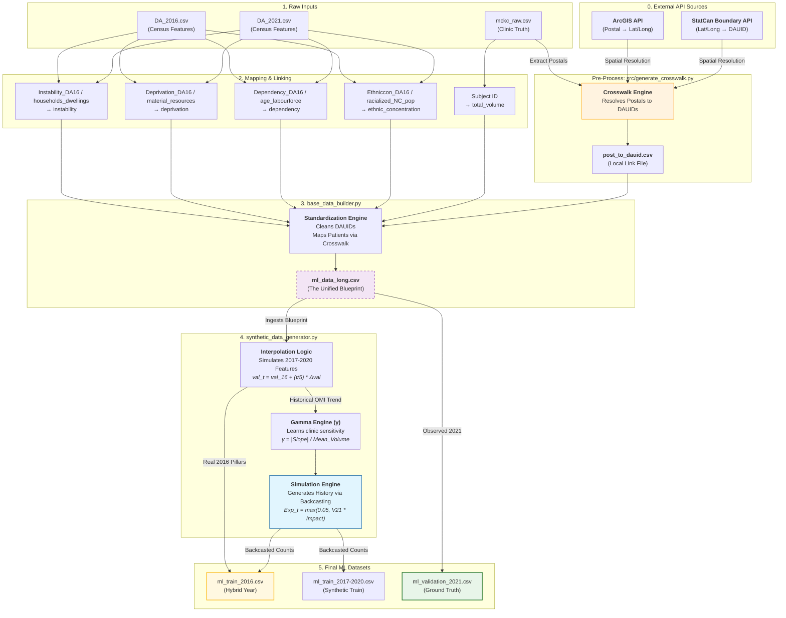

# Granular Column Lineage & Flowchart

This document provides the low-level mapping of every raw data column to its final destination in the ML datasets.

## Detailed Mermaid Code

You can paste this into the [Mermaid Live Editor](https://mermaid.live/) for a high-resolution view.

## Transformation Logic Table

| Final Column | Raw Input | Logic Used |
| :--- | :--- | :--- |
| `instability` | `Instability_DA16` (2016) | `val16 + frac * (val21 - val16)` |
| `deprivation` | `Deprivation_DA16` (2016) | `val16 + frac * (val21 - val16)` |
| `dependency` | `Dependency_DA16` (2016) | `val16 + frac * (val21 - val16)` |
| `ethnic_concentration` | `Ethniccon_DA16` (2016) | `val16 + frac * (val21 - val16)` |
| `omi_composite` | Mean(4 pillars) | Calculated *post-interpolation*. |
| `patient_volume` | Real 2021 Patients | **Anchor** for backcasting history. |
| `patient_volume` | 2016-2020 History | `Random_Poisson(Expected_Backcast)` |
